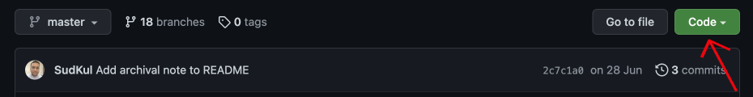
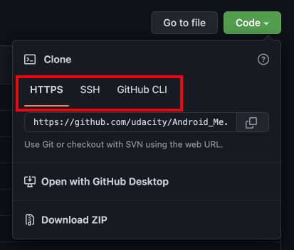
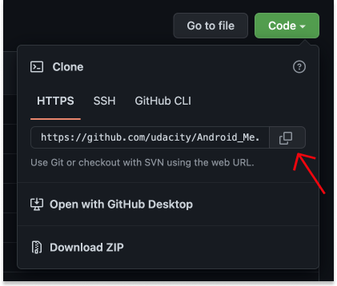
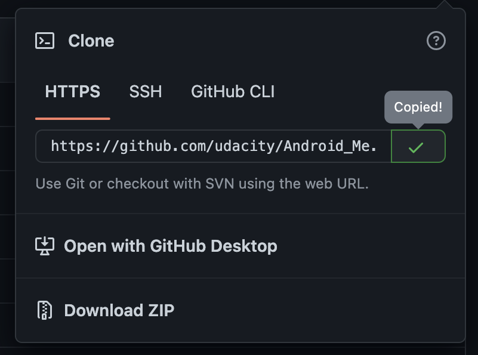
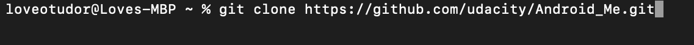
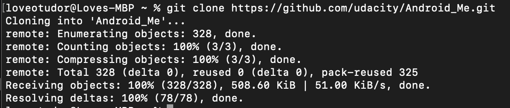
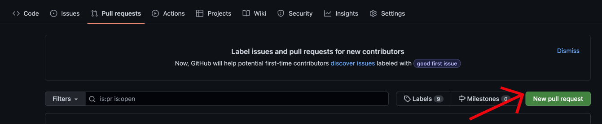
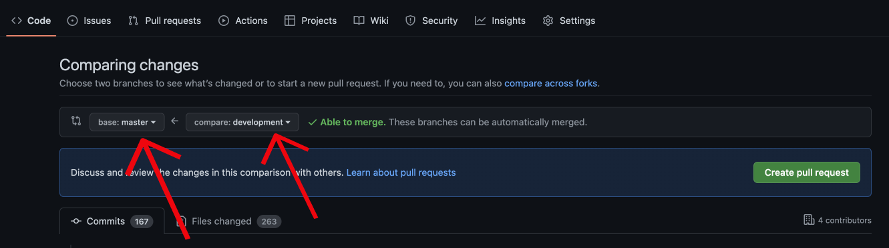
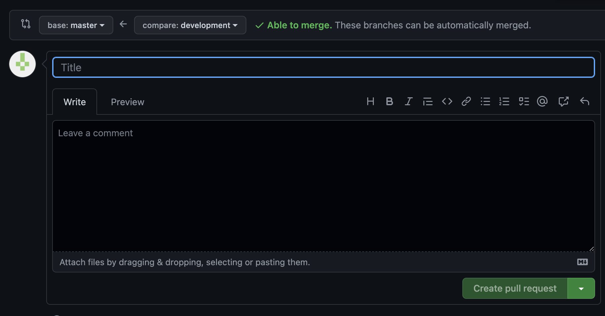

Starting a career in tech, you can easily get overwhelmed by the number of languages, frameworks, tools, and platforms available. One popular platform which is always talked about is Github. You must have come across it either from a developer or while trying to learn something in software development.

The many use cases of GitHub could leave you wondering, is it a social networking site for developers? Or a place where code is shared? I have seen some articles on GitHub, does it support documentation?

### In this article, you will:
* Learn about GitHub and why it is necessary.
* Clone a repository, make commits, and create a pull request.
* Compare Github Desktop versus Github CLI

### Prerequisites:
1. Basic knowledge of commands used in the terminal. Check out this article: [17 Terminal commands every user should know](https://www.techrepublic.com/article/16-terminal-commands-every-user-should-know/).
2. An internet connection.

## What is Github?
GitHub is an online code hosting platform and version control system, where developers and programmers can collaborate or work on software projects together. This makes it possible to keep track of the work done and easily navigate between the various versions of the project while managing the online backup.
GitHub is free and quite simple to use and plays a significant role in the Open Source movement.

## Why Github?
Someone asked on [Quora](https://www.quora.com/How-did-programmers-work-before-version-control-systems-were-created): "How did programmers work before version control systems were created?". [Ted Dunning](https://www.quora.com/profile/Ted-Dunning-1) answered: "Oh please, don't remind me. It was a nightmare..."

Apart from being a popular version control system, GitHub is a web-based platform that makes it possible to easily share and collaborate on a project, even if it doesn't belong to you while providing an online backup of the original file. You can request reviews, review, and comment on other people's changes, recommend changes and assign tasks. Every file on GitHub has a history. This makes it easy to see the changes that have occurred at different time intervals.

## Git vs. GitHub
Many people have this misconception that Git and GitHub are just the same, but they are not. Git can be used without GitHub.

Git is a distributed version control system that monitors the several versions of a file and the changes made. The majority of Git's operations can be carried out offline, users can set up and run Git on their local computers.
### However,
GitHub is a web-based code hosting platform for storing Git repositories online. This means that you will need an internet connection to use Github. Users can make their online repositories private or open for others to collaborate.

The table below highlights a few differences between Git and Github:

| S/N | Git                                                               | GitHub                                                                   |
|-----|-------------------------------------------------------------------|--------------------------------------------------------------------------|
| 1.  | Monitors the several versions of a file and the changes made.     | Stores Git repositories online.                                          |
| 2.  | Can be used without GitHub.                                       | Cannot function without Git.                                             |
| 3.  | Git operations can be carried out offline on your local computer. | GitHub is a web-based platform and thus requires an internet connection. |
| 4.  | Does not have user management capabilities.                       | Has user management capabilities.                                        |
| 5.  | Git is an Open Source project.                                    | GitHub is not Open Source.                                               |

## How To Clone A Repository
Earlier you read that GitHub is a platform for hosting Git repositories online. You may ask: "**What are repositories?**".

A repository is a folder that contains all of your project's files and the revision history of these files.

A repository can be owned individually, or co-owned by members of your organization.
When you clone a repository from GitHub.com, you copy it to your local computer. This makes it easier to make changes, add or remove files, etc.

### Listed below are the steps to clone a repository on GitHub using a web browser:
**Step One:** Navigate to the repository's home page on GitHub.com.

**Step Two:** Above the repository's file list, Click Code. 

A popup menu will appear, that looks like this:

* Clicking "HTTPS" clone's the repository via HTTPS.
* Clicking "SSH", clones the repository using a password-protected SSH key and a certificate provided by the SSH certificate authority for your company.
* Clicking on "GitHub CLI", clones the repository using GitHub's command-line tool.

**Step Three:** Select the HTTPS tab and click on the copy icon to copy the web URL

**Step Four:** Launch the Terminal on your Linux or Mac computer (For Windows, use Bash).

**Step Five:** Change the current working directory to the file location where the cloned directory will be stored.

**Step Six:** On the terminal, type in `git clone ` and then paste the web URL to the repository.

**Step Seven:** Press **Enter** to create and download your local clone.

With your local clone of the repository, you can easily make changes, create, and add files to it. You can then commit these changes and push them.

**Note:**
You cannot make changes directly to a repository you do not own. You will have to fork the repository first to your GitHub account, before cloning the forked repo. You can read more about forks [here](https://docs.github.com/en/get-started/quickstart/fork-a-repo).

## How To Commit To GitHub
A commit is similar to a picture of your repository at a particular time. They represent time-stamped snapshots of your whole repository. It is advised to frequently create new commits based on logical units of changes made.

With time, commits show the history of the repository:
* the different changes made,
* its author,
* timestamp, and
* some metadata.

### Listed below are the steps to commit local changes on GitHub:
**Step One:** Launch the Terminal.

**Step Two:** Change the current working directory to the file location where the cloned directory will be stored.

**Step Three:** On the terminal, type in `git init`. This is to initialize the current directory as a Git repository. The default initial branch is master.

**Step Four:** Press **Enter**.

**Step Five:** On the terminal, type in `git add .` and press **Enter**. This adds and stages the files in the local repository for commit.

**Step Six:** On the terminal, type in `git commit -m "descriptive commit message"`. Enter your commit message within the quotes. This commits the staged files with a commit message.

Now that you have committed your changes, you will have to push these local changes to the remote GitHub repository. We said earlier that we will need the internet to do anything on Github, thus you need an internet connection to push these changes to its remote GitHub repository.

### Listed below are the steps to push changes to GitHub:

**Step One:** On the terminal type in `git remote add origin <REMOTE_URL>`. This sets the remote repository, where your local repository will be pushed.

**Step Two:** On the terminal type in `git remote -v` to verify the remote repository's URL is correct.

**Step Three:** On the terminal type in `git push -u origin main`. This updates the remote repository on GitHub.com with the changes in your local repository.

## Create A Pull Request
A pull request proposes changes in a branch you want to be merged into a repository. This ensures that the main branch only contains finished and approved work.

When creating a pull request, select which branch you want to merge your changes into. A pull request can only be opened between two different branches.

If you don't have write access to a repository, but still want to create a new branch for your pull request, you will have to fork the repository first.

### Listed below are the steps to create a Pull Request using a web browser:

**Step One:** Navigate to the repository's home page on GitHub.com.

**Step Two:** On the repository's tabs select **Pull Requests**.

**Step Three:** Click on the **New Pull request** button.

**Step Four:** Choose the branch of the upstream repository you want to merge changes into from the **base** branch drop-down option.

**Step Five:** Choose the branch where your modifications were made from the **compare** branch drop-down option.

**Step Six:** Click on the **Create Pull request** button. This opens up the window as shown below:

**Step Seven:** Enter the title of your pull request in the **title** field.

**Step Eight:** Enter a description in the **Leave a comment** field. You can attach files to the description by dragging and dropping, selecting, or pasting them.

**Step Nine:** Below the **Leave a comment** field, click on **Create pull request** button, to create a pull request that is ready for review. To create a draft pull request, Click on the drop-down and then select **Create Draft Pull Request**.

## GitHub Desktop vs. GitHub CLI
GitHub Desktop and GitHub CLI are other ways in which you can interact with GitHub other than through its website.

GitHub CLI(also known as Command Line Interface) makes it possible to take advantage of GitHub's features from your terminal. It is open source and saves the time used in navigating through UI. You can check out their official [website](https://cli.github.com/) to learn how you can install and start using Github CLI.

On the other hand, GitHub Desktop simplifies and enhances your GitHub workflow through an easy-to-use visual interface. With GitHub Desktop, you don't have to be conversant with the terminal, but you can perform Git and GitHub operations by interacting with UI elements. You can check out their official [website](https://desktop.github.com/ ) to learn how you can install and start using GitHub Desktop.

GitHub Desktop and GitHub CLI are both Open Source projects, which extend the use of GitHub to suit your different preferences. Whether you prefer the straightforwardness of the command line interface or the simplicity of a visual interface.

## Conclusion
GitHub makes it easier to create and collaborate on software projects. Software development can take place simultaneously and iteratively while storing the history of each change.

You can now carry on editing files, adding, and pushing changes, and opening pull requests. You can check out the [GitHub Docs](https://docs.github.com/en/desktop/contributing-and-collaborating-using-github-desktop) for more advanced tutorials.

Thank You! :)

